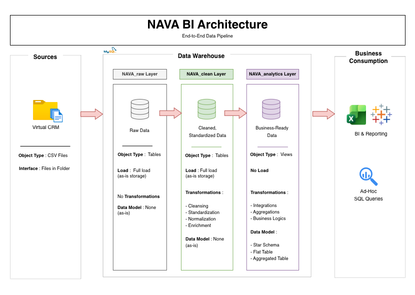

# 00 Technical Foundation (Shared SQL Architecture)

This section contains the shared SQL architecture powering the entire NAVA Business Intelligence solution.

All analytical projects rely on the same SQL data warehouse, ensuring consistent business definitions, standardized transformations and reusable analytical views.

---

# 🏗️ Data Architecture

The solution follows a multi-layer SQL architecture designed to transform raw operational data into business-ready datasets.

<p align="center">
  
</p>

---

# 📖 Overview

## ✍️ Design Principles

The technical foundation was designed so that a single SQL architecture supports multiple business domains while maintaining consistent business definitions and analytical logic.

## ✅ Key Capabilities

- **Shared SQL Architecture** supporting multiple analytical projects
- **Multi-layer Data Warehouse** (Raw → Clean → Analytics)
- **Reusable Analytical Views** optimized for reporting
- **Integrated Data Quality Controls** throughout the ETL process
- **Business-ready Datasets** designed for Tableau dashboards

---

# 📂 Repository Structure

```text
00_Technical_Foundation
│
├── datasets/
│
├── scripts/
│   ├── 01_Raw_Layer/
│   ├── 02_Clean_Layer/
│   ├── 03_Analytics_Layer/
│   └── 04_Data_Quality/
│
└── README.md
```

---

# 💡 Purpose

The objective of this technical foundation is to provide a single, reliable and reusable SQL architecture supporting all analytical projects within the NAVA Business Intelligence portfolio.
