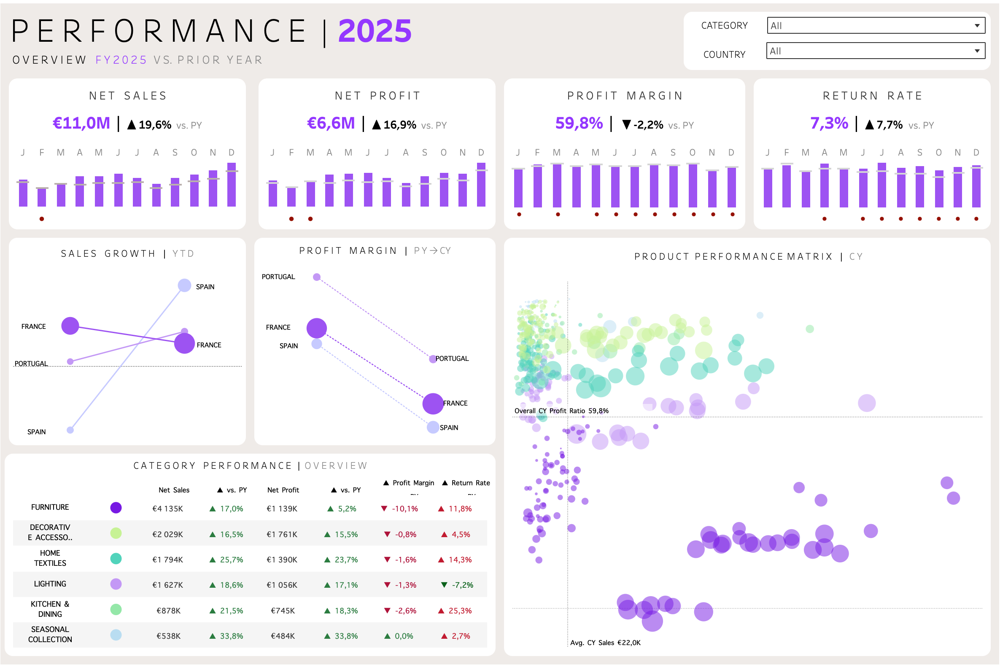

# 01 Sales Performance

This project analyzes the commercial performance of **NAVA** to evaluate revenue growth, profitability and customer performance across France, Spain and Portugal.

The dashboard transforms transactional sales data into actionable business insights, helping stakeholders monitor performance and identify opportunities for improvement.

---

# 🎯 Business Objective

Assess whether business growth is sustainable by monitoring sales, profitability and operational performance.

---

# 📊 Dashboard Overview

<p align="center">
  
</p>

---

# 🔍 Key Performance Indicators

- Net Sales
- Net Profit
- Profit Ratio
- Orders
- Customers
- Average Order Value (AOV)
- Return Rate

---

# 💡 Summary of Insights

- Spain continues to drive overall business growth.
- Profitability declined despite higher revenue.
- High-performing product categories generate the greatest business value.
- Return rates continue to pressure overall margins.

---

# 🎯 Recommendations & Next Steps

- Improve profitability while sustaining revenue growth.
- Reduce return-related costs in underperforming categories.
- Expand investment in high-performing product categories.
- Monitor margin performance across all markets.

---

# 🛠️ Technical Implementation

**SQL View**

- `vw_sales_net`

**Built With**

- MySQL
- Tableau

The dashboard is powered by the shared SQL architecture available in **00_Technical_Foundation**.

---

# 📂 Project Structure

```text
01_Sales_Performance
│
├── dashboard/
│   ├── sales_performance.twbx
│   └── sales_dashboard.png
│
├── README.md
```
