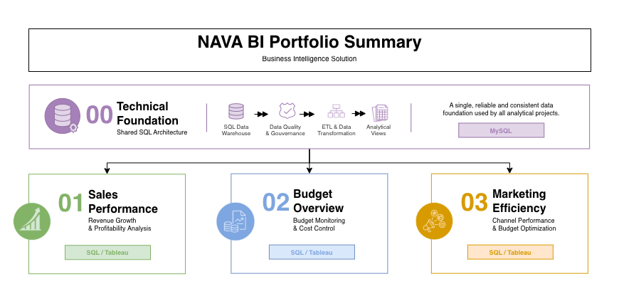

# NAVA Business Intelligence Portfolio

This repository showcases an end-to-end Business Intelligence solution developed for **NAVA**, a fictional Home Decor & Lifestyle e-commerce company operating across **France, Spain and Portugal**.

The portfolio demonstrates the complete BI workflow, from SQL data engineering to interactive dashboards designed to support business decision-making.

---

# 📖 Overview

The portfolio is built around a **shared SQL architecture** powering three independent business-oriented analytical projects.
<p align="center">
  
</p>

---

# 📖 Project Requirements

## 🏗 Building the Data Warehouse (Data Engineering)

#### Objective

Design and implement a robust SQL architecture capable of transforming raw operational data into reliable analytical datasets.

### Deliverables

- Multi-layer SQL Architecture
- Raw, Clean & Analytics databases
- Data Cleansing & Standardization
- ETL Pipelines
- Data Quality Controls
- Business-ready SQL Views

For more details, refer to [00_technical_foundation ReadMe]

## 📊 Business Intelligence & Reporting (Data Analysis)

### Objective

Develop interactive dashboards and analytical views that support business decision-making across multiple departments.

### Deliverables

SQL-based analytics to deliver detailed insights into :

- **Sales Performance** (see more)
- **Budget Overview** (see more)
- **Marketing Efficiency** (see more)

---

# 📂 Repository Structure

```text
NAVA-Business-Intelligence-Portfolio
│
├── 00_Technical_Foundation/
│   ├── datasets                                                # Raw datasets used for the project
│   ├── scripts                                                 # SQL scripts for ETL and transformations
│   ├── tests                                                   # Test scripts and quality files                   
│
├── 01_Sales_Performance
│
├── 02_Budget_Performance
│
└── 03_Marketing_Performance
│
└── assets
│
└── README.md                                                  # Project overview and instructions

---

## About this Project

This portfolio was designed to simulate a real Business Intelligence environment, demonstrating how raw operational data can be transformed into business-ready insights through SQL, Tableau and analytical thinking.
