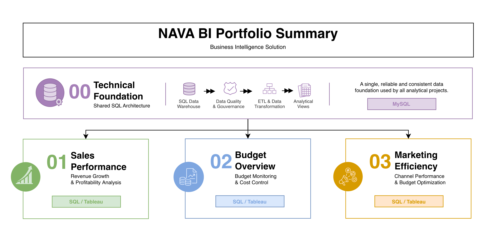

# NAVA Business Intelligence Portfolio
> <i>SQL • Data Engineering • Tableau • Business Analytics</i>

Welcome to the **NAVA Business Intelligence Portfolio**.

This portfolio showcases an end-to-end Business Intelligence solution developed for **NAVA**, a fictional Home Decor & Lifestyle e-commerce company operating across **France, Spain and Portugal**.

The project demonstrates the complete BI lifecycle, from SQL data engineering and data modeling to interactive dashboards supporting business decision-making.

---

# 📖 Overview

The portfolio is built on a **shared SQL architecture** that powers three independent business-oriented analytical projects.

  

      One shared SQL architecture. Four complementary repositories. One Business Intelligence solution.

---

# 📖  Portfolio Components

The portfolio is divided into four independent repositories. Each project can be explored individually while remaining part of the same Business Intelligence ecosystem.

## 🏗 Building the Data Warehouse (Data Engineering)

#### Objective

Design and implement a robust SQL architecture capable of transforming raw operational data into reliable, business-ready datasets.

### Key Deliverables

- Multi-layer SQL Architecture
- Raw, Clean & Analytics databases
- Data Cleansing & Standardization
- ETL Pipelines
- Data Quality Controls
- Business-ready Analytical Views
  

## 📊 Business Intelligence & Reporting (Data Analysis)

### Objective

Develop interactive dashboards and analytical solutions that support business decision-making across multiple functions.

### Business Projects

SQL-based analytics to deliver detailed insights into :

- **Sales Performance**
- **Budget Overview**
- **Marketing Efficiency**

---

# 🔗 Quick Access

| Repository | Description | Github Link |
|------------|--------|----------------|
| 📖 Portfolio Hub | Solution overview and navigation | [Learn More](README.md/) |
| 📁 00 Technical Foundation | SQL Architecture, ETL & Analytics Views | [Learn More](https://github.com/ammflo-ops/NAVA-00-Technical-Foundation/blob/main/README.md) |
| 📊 01 Sales Performance | Revenue Growth & Profitability Analysis | [Learn More](https://github.com/ammflo-ops/NAVA-01-sales-performance/blob/main/README.md) |
| 📊 02 Budget Performance | Budget Monitoring & Variance Analysis | [Learn More](https://github.com/ammflo-ops/NAVA-02-budget-overview/blob/main/README.md) |
| 📊 03 Marketing Performance | Marketing Efficiency & Budget Optimization | [Learn More](https://github.com/ammflo-ops/NAVA-03-marketing-optimization/blob/main/README.md) |

---

# 💡 About this Portfolio

This portfolio was developed to replicate a real-world Business Intelligence solution, demonstrating how a shared SQL architecture supports multiple business domains through reusable analytical models and interactive reporting.
